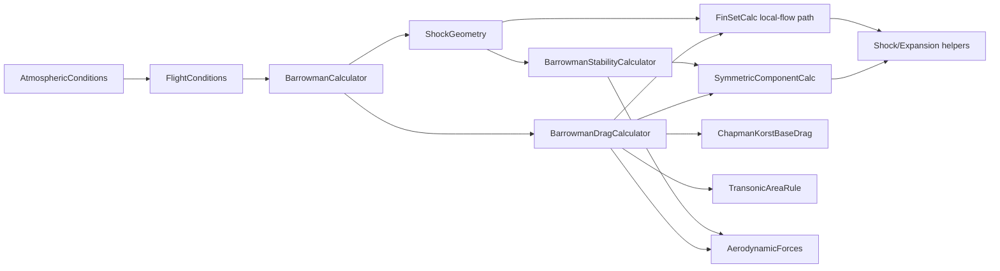
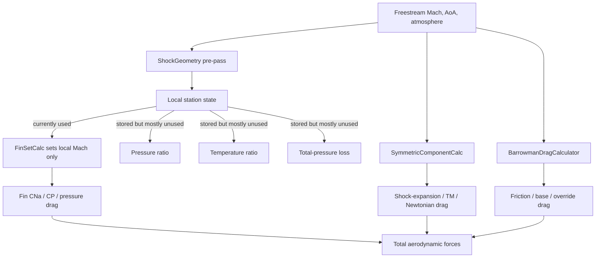

# Supersonic Aerodynamics Audit of openrocketsupersonic

## Executive summary

This branch is **not just a light tweak of base OpenRocket**. It adds a substantial supersonic stack: a new drag orchestrator (`BarrowmanDragCalculator`), a split stability/drag architecture (`BarrowmanCalculator` + `BarrowmanStabilityCalculator`), local post-shock flow precomputation (`ShockGeometry`), explicit normal/oblique shock and Prandtl–Meyer solvers, DATCOM-style fin wave drag, shock-expansion nose drag, a more exact atmosphere model, power-on base-drag reduction hooks, SBLI and transonic-correction helpers, and multiple benchmark-style tests against NACA/NASA references. The branch also upgrades core state objects so aerodynamic code can carry nozzle, plume, and turbulence flags through the solver. citeturn20view0turn21view0turn23view0turn24view0turn24view1turn24view2turn26view0turn31view0turn35view3turn35view4turn35view5turn35view6turn45view0

The strongest parts of the branch are the **compressible-flow primitives and atmosphere/skin-friction upgrades**. The normal-shock, oblique-shock, cone-flow, and Prandtl–Meyer utilities are classical and well aligned with NACA 1135-style relations; the atmosphere model replaces legacy linear approximations with ideal-gas/speed-of-sound/Sutherland-law expressions; and the skin-friction path explicitly moves to Van Driest II above Mach 1.1, with a dedicated benchmark against NASA TN D‑5089 flat-plate data. Those are real improvements over upstream OpenRocket’s older monolithic Barrowman path and its older atmospheric approximations. citeturn24view0turn24view1turn24view2turn18view1turn23view0turn38view0turn48view0turn47view3turn46search0

However, your observation that it “doesn’t feel much different from base OpenRocket” is credible. The audit found several reasons why the branch’s most interesting supersonic ideas can have **muted end-user impact**. The biggest one is that the fin local-flow correction uses `ShockGeometry`, but `FinSetCalc` only clones the freestream conditions and overwrites **Mach**; it does not propagate local pressure, temperature, density, or total-pressure loss into the fin force calculation, even though `ShockGeometry` stores those quantities. In practice that means a lot of the body-shock pre-pass is computed, validated, and then only partially consumed. citeturn11view0turn28view0

A second reason is that several high-level effects are either **deliberately weakened or effectively inactive**. The Pitts–Nielsen–Kaattari body/fin-interference correction is explicitly turned off for `M >= 1.3` by forcing `F_WB = F_BW = 1.0`; the aeroelastic model is hard-disabled by setting `Q_THRESHOLD = 1.0e12`; the Magnus and some damping terms use fixed heuristics like `cnaBody = 0.3 * cnaTotal` and `CmAlphaDot = 0.4 * Cmq`; and some benchmark tests are diagnostic-only or validate the code against formulas that the code itself hard-codes. So there is a meaningful supersonic framework here, but part of it is not yet translated into consistently stronger trajectory-level behavior. citeturn26view0turn35view3turn44view0turn48view2turn39view6

Compared with current upstream OpenRocket master as of this audit date, the fork clearly goes further in supersonic modeling. Current upstream `FinSetCalc` has no `ShockGeometry`, no DATCOM fin-wave implementation, no PNK interference helper, and no trailing-edge supersonic fin-base term; upstream `BarrowmanCalculator` is still monolithic rather than split into dedicated drag and stability calculators; upstream `FlightConditions` lacks thrust/nozzle/plume state; and upstream `AtmosphericConditions` still uses a linearized speed-of-sound relation and linearized viscosity path instead of the more exact ideal-gas and Sutherland-law treatment used here. citeturn30view0turn30view1turn30view2turn30view3turn43view0turn47view0turn47view1turn47view2turn47view3turn47view4turn47view5turn21view0turn23view0

My bottom-line assessment is this: **the branch has good reusable building blocks, but its end-to-end supersonic behavior is still bottlenecked by partial state propagation, heuristic damping/stability closures, several calibration hooks embedded in production code, and incomplete benchmark closure around trajectory-level outcomes**. If you want to integrate “the good parts” into your own fork, you should absolutely keep the shock/expansion utilities, atmosphere upgrades, Van Driest II path, and much of the nose/fin wave-drag work—but you should rewire local-flow propagation, harden the tests, and trim or isolate the corpus-fitting and ablation knobs before trusting the branch as a production supersonic model. citeturn24view0turn24view1turn24view2turn18view1turn23view0turn28view0turn44view0turn45view0

## Repository inventory and architecture

The repository’s supersonic work is concentrated in a fairly coherent set of production classes. The core orchestration layer is in `core/src/main/java/info/openrocket/core/aerodynamics/BarrowmanCalculator.java`, which now computes `ShockGeometry` once per aerodynamic evaluation and injects it into the stability calculator before drag is computed. Drag is separated into `BarrowmanDragCalculator.java`, and stability into `BarrowmanStabilityCalculator.java`, with component-level implementations living mainly in `barrowman/FinSetCalc.java` and `barrowman/SymmetricComponentCalc.java`. Compressible-flow primitives live under `aerodynamics/shocks/`, while atmosphere/state propagation upgrades live in `FlightConditions.java` and `AtmosphericConditions.java`. Additional support modules include `PittsNielsenKaattari`, `TransonicSimilarity`, `FreeInteractionSBLI`, `AeroelasticModel`, `PlumeModel`, `TransonicAreaRule`, `RationalBlend`, and `ChapmanKorstBaseDrag`. citeturn20view0turn16view0turn44view0turn26view0turn31view0turn24view0turn24view1turn24view2turn21view0turn23view0turn36view0turn36view1turn36view2turn35view3turn35view4turn35view5turn35view6turn45view0

The table below catalogs the main supersonic-related files I directly confirmed and what each one appears to own.

| File or module | Primary responsibility | Audit note |
|---|---|---|
| `aerodynamics/BarrowmanCalculator.java` | Top-level aero orchestration | Computes `ShockGeometry` once, passes it into stability, then runs drag and sanitization. citeturn20view0turn20view1turn20view2 |
| `aerodynamics/BarrowmanDragCalculator.java` | Friction, pressure, base, override drag | Main supersonic drag hub; contains Van Driest II, Devan–Ashwood base drag, power-on base drag, slender-body corrections, finned-base logic, and more. citeturn16view0turn17view0turn18view4turn19view0 |
| `aerodynamics/BarrowmanStabilityCalculator.java` | Non-axial forces and damping | Carries shock geometry into component calcs and implements damping, Magnus, `Cmq`, and `CmAlphaDot`. citeturn44view0 |
| `aerodynamics/FlightConditions.java` | Flow-state container | Adds Mach smoothing, thrust/nozzle fields, force-turbulent flag, and plume-state storage. citeturn21view0turn22view0 |
| `models/atmosphere/AtmosphericConditions.java` | Atmosphere and transport properties | Exact sound speed, Sutherland viscosity, humidity-aware gas constant, effective gamma. citeturn23view0 |
| `barrowman/FinSetCalc.java` | Fin normal force and pressure/base drag | Uses local post-shock Mach, DATCOM wave drag, SBLI, PNK interference, transonic similarity, trailing-edge drag. citeturn26view0turn28view0turn28view3turn29view0 |
| `barrowman/SymmetricComponentCalc.java` | Body/nose normal force and pressure drag | Implements Mach-dependent body-lift blending, shock-expansion/Taylor–Maccoll nose wave drag, Newtonian high-Mach blend. citeturn31view0turn33view1turn33view2turn33view3turn34view0 |
| `aerodynamics/shocks/NormalShockRelations.java` | Exact normal-shock relations | Pressure, density, temperature, downstream Mach, stagnation-pressure loss. citeturn24view0 |
| `aerodynamics/shocks/ObliqueShockSolver.java` | Wedge/cone oblique shock and cone flow | Theta-beta-Mach solver, cone shock angle, Taylor–Maccoll-based cone solution. citeturn24view1turn25view0turn25view2 |
| `aerodynamics/shocks/PrandtlMeyerExpansion.java` | Expansion-fan solver | Downstream Mach and isentropic ratios across an expansion fan. citeturn24view2turn25view4 |
| `barrowman/PittsNielsenKaattari.java` | Fin/body interference correction | Smoothstep-blended supersonic correction factors `F_WB` and `F_BW`. citeturn36view0 |
| `barrowman/TransonicSimilarity.java` | ESDU-style fin transonic correction | Uses `K_trans = (M²-1)/(t/c)^(2/3)` and a tabulated universal curve. citeturn36view1 |
| `barrowman/FreeInteractionSBLI.java` | Shock/boundary-layer interaction helper | Separation onset, separation length, momentum thickness estimate, plateau pressure. citeturn36view2turn37view0 |
| `aerodynamics/AeroelasticModel.java` | Fin aeroelastic effectiveness | Present, but effectively disabled by an extreme dynamic-pressure threshold. citeturn35view3 |
| `aerodynamics/TransonicAreaRule.java` | Area-rule wave-drag helper | Implements a Whitcomb-style area-distribution path for transonic wave drag. citeturn37view1turn46search6 |
| `aerodynamics/RationalBlend.java` | Smooth regime blending utility | AP09-style rational blend helper for subsonic/supersonic transitions. citeturn37view2 |
| `aerodynamics/PlumeModel.java` | Power-on plume/separation helper | Underexpanded plume blockage and fin-effectiveness reduction. citeturn37view3 |
| `aerodynamics/ChapmanKorstBaseDrag.java` | Alternative base-drag model | Separate Chapman–Korst / laminar base-drag helper; deserves call-site verification in production path. citeturn45view0turn18view4 |

The architecture is conceptually sound: a single pre-pass computes a stationwise view of supersonic local flow; component calculators can then consume that pre-pass without each re-solving shocks; and dedicated helper modules isolate the gas-dynamics math from trajectory plumbing. That is a major design improvement over the current upstream monolithic `BarrowmanCalculator`, which still bundles CP/drag logic in one class and shows no equivalent `ShockGeometry` path. citeturn20view0turn43view0turn30view1



One architectural caution is that the branch mixes **production physics** and **research/ablation switches** in the same codepath. Examples include `AblationConfig.disableDatcomFinWaveDrag`, `AblationConfig.disablePNK`, an atmospheric density scale factor in `AtmosphericConditions`, and a base-drag asymptote override in `BarrowmanDragCalculator`. That is useful for paper-generation or sensitivity studies, but it makes production behavior harder to reason about unless those knobs are isolated, frozen, and surfaced explicitly. citeturn29view0turn36view0turn23view0turn18view4

## Modeling details for supersonic regimes

The branch’s classical compressible-flow core is its cleanest part. `NormalShockRelations` implements the standard perfect-gas normal-shock formulas:  
`p2/p1 = 1 + 2γ/(γ+1) * (M1² - 1)`,  
`ρ2/ρ1 = ((γ+1) M1²) / ((γ-1) M1² + 2)`,  
`T2/T1 = (p2/p1)/(ρ2/ρ1)`,  
`M2² = (M1² + 2/(γ-1)) / ((2γ/(γ-1)) M1² - 1)`, and the Rayleigh total-pressure-loss expression. `ObliqueShockSolver` adds the standard theta–beta–Mach relation and uses bracketing/bisection for robustness. Those formulas are exactly the kind of relations tabulated in NACA Report 1135, and the code comments explicitly anchor them there. citeturn24view0turn24view1turn25view2turn46search0

For cones, the branch goes beyond a wedge approximation. `ObliqueShockSolver.solveCone` finds a cone shock angle, then computes post-shock surface conditions using a Taylor–Maccoll path; `conePressureCoefficient` returns `Cp = 2/(γ M1²) * (p_surface/p1 - 1)`. The cone solver is then reused both directly for conical noses and indirectly as the nose-tip initializer for the more general shock-expansion march used on ogives and other axisymmetric noses. That is a materially better choice than a pure wedge-style closure for axisymmetric nose cones. citeturn25view0turn25view1turn33view2turn33view3

The Prandtl–Meyer helper is also standard. `PrandtlMeyerExpansion.downstreamMach` computes `ν2 = ν(M1) + δ` and inverts for `M2`; pressure ratio is then computed from the isentropic relation  
`p2/p1 = [(1 + (γ-1)M1²/2) / (1 + (γ-1)M2²/2)]^(γ/(γ-1))`. That is the correct structure for shoulder expansions and for shock-expansion marching over smooth expanding surfaces. citeturn25view4

The fork’s **fin normal-force model** is still fundamentally a Barrowman-style `CNa` model, but with several supersonic augmentations. For `M >= CNA_SUPERSONIC`, `FinSetCalc` tabulates `K1 = 2/β`, a nonlinear `K2`, and a higher-order `K3`, then forms the supersonic `cna1` from those coefficients. It also adds a low-aspect-ratio, subsonic-leading-edge `K1` floor that decays exponentially once the leading-edge normal Mach exceeds unity. This is one of the areas where the branch is clearly trying to correct classical slender-linear theory in a practical way. citeturn28view1turn27view1

At the same time, several of the fin corrections are more empirical than first-principles. `PittsNielsenKaattari` computes `F_WB` and `F_BW` with custom formulas based on `β_s = sqrt(M²-1) * semispan / rootChord` and a body-radius ratio, then smoothstep-blends them from Mach 0.85 to 1.15. `TransonicSimilarity` computes `K_trans = (M_eff² - 1)/(t/c)^(2/3)`, uses an eight-point hard-coded universal curve, and defines a peak `CNa` with a thickness polynomial. Those are plausible engineering surrogates, but they are not direct faithful implementations of the original report charts, and I did not find matching external benchmark files for them in the directly inspected tests. citeturn36view0turn36view1

The **fin wave-drag path** is more mature. The code comments first explain the classical Ackeret thin-airfoil relation `Cdw = 4 τ² / β` and then replace the old simple swept correction with a DATCOM-style split between subsonic and supersonic leading edges. In the DATCOM helper, if `β * cot(Λ_LE) >= 1`, the code uses `C_Dw = K τ² / β`; otherwise it uses `C_Dw = K cot(Λ_LE) τ²`, with `K` selected by fin cross section. The branch then blends wave drag in smoothly through a cubic-Hermite transonic ramp and rescales it from planform reference to rocket reference area. This is a clear step up over upstream `FinSetCalc`, which has no corresponding `datcomWaveDragCD` path at all. citeturn27view4turn28view4turn29view0turn30view0

The **body/nose pressure-drag path** is also significantly upgraded. `SymmetricComponentCalc` keeps the classical area-change normal-force pieces, but for pressure drag it builds an interpolated nose-wave curve: empirical transonic data first, then a blend into Taylor–Maccoll for conical noses or a stripwise shock-expansion integration for ogives and other smooth axisymmetric shapes, and then a further blend toward Modified Newtonian theory above Mach 4–6. The shock-expansion drag integral is explicitly  
`Cd = 2 * integral(Cp * r * dr) / (R_aft² - R_fore²)`,  
and the Modified Newtonian branch uses `Cp = Cp_max sin² θ`. That overall structure is physically sensible and markedly richer than the short upstream `SymmetricComponentCalc`. citeturn33view1turn33view2turn33view3turn31view1turn32view1

For friction, the branch chooses the right battle. `BarrowmanDragCalculator` documents a transonic handoff and a supersonic Van Driest II path; the implementation computes adiabatic wall temperature, Van Driest transformation factors `Fc` and `Ftheta`, maps to equivalent incompressible Reynolds number, solves the Schoenherr relation, then transforms back. That is a real improvement over the older OpenRocket atmosphere/transport stack, and it is one of the fork’s best-justified changes. citeturn17view0turn18view1turn38view0turn48view0turn47view3

The **base-drag model** is more of a mixed bag. In the main production path inside `BarrowmanDragCalculator`, the baseline base drag is still a subsonic polynomial `0.12 + 0.13 M²`, a transonic C1 polynomial between Mach 0.85 and 1.5, and a Devan–Ashwood-type asymptote `0.064 + 0.186/M²` above Mach 1.5. On top of that, the branch layers finned-base augmentation, thick-boundary-layer amplification, boattail factors, power-on reductions, and slender-body pressure-drag adders. Separately, the repository also contains a `ChapmanKorstBaseDrag` class with turbulent and laminar base-drag alternatives, including `Cpb_lam = 1870/(M² sqrt(Re_L))`, but the production `calculateBaseCD` entry point I inspected still returns the Devan–Ashwood/transonic path directly. My inference is that `ChapmanKorstBaseDrag` is either unused or only partially wired at present. citeturn17view1turn18view4turn18view5turn19view0turn45view0

The treatment of local shocks is where the branch is **most promising and most unfinished**. The `ShockGeometry` validation test shows the pre-pass computes local Mach, pressure ratio, and temperature ratio at body stations and matches analytical Taylor–Maccoll and Prandtl–Meyer references very tightly for sampled cone-cylinder cases. But `FinSetCalc.getLocalFlowConditions` only clones the freestream `FlightConditions` and calls `setMach(local.localMach)`. Pressure ratio, temperature ratio, density change, and total-pressure loss are not pushed into the fin-force path, even though the local-flow object stores them. So the repository has a strong local-flow engine, but the component solver currently drinks only one sip from it. citeturn11view0turn28view0



## Data flow and state propagation

The main aerodynamic data flow begins at `FlightConditions` and `AtmosphericConditions`. `FlightConditions` stores Mach, AoA, `beta`, roll/pitch/yaw rates, reference area/length, plus new fields for thrust level, nozzle area ratio, a force-turbulent-BL flag, and plume state. When Mach changes, `beta` is recomputed immediately; the branch replaces the old transonic singularity with a cubic-Hermite smoothing between Mach 0.95 and 1.05 so `beta` no longer crosses through zero abruptly in that band. citeturn21view0turn22view0

That change matters because many downstream formulas depend on `beta = sqrt(|1 - M²|)`. In upstream OpenRocket, there is no equivalent `TRANSONIC_LOW` / `TRANSONIC_HIGH` smoothing visible in `FlightConditions`, so the branch is explicitly trying to control the numerical stiffness that appears near Mach 1. The corresponding top-level calculator also has a coefficient sanitization stage that clamps non-finite or extremely large `CD`, `CN`, and `Cm`, again showing that transonic singularity management is a deliberate design concern in this branch. citeturn47view2turn20view2

`AtmosphericConditions` is the next key producer. The branch computes density from a humidity-aware gas constant, sound speed from `sqrt(γ R T)`, dynamic viscosity from Sutherland’s law, kinematic viscosity from `μ/ρ`, and even exposes an `effectiveGamma(stagnationTemp)` that reduces gamma toward about 1.3 at high temperature. In current upstream OpenRocket master, by contrast, `getMachSpeed()` still uses the older linear fit `165.77 + 0.606*T` and `getKinematicViscosity()` uses a linearized approximation, with no `getDynamicViscosity()` or `effectiveGamma()` helper visible. citeturn23view0turn47view3turn47view4turn47view5

At run time, `BarrowmanCalculator` now performs a pre-pass: it builds `ShockGeometry`, hands that object to `BarrowmanStabilityCalculator`, runs non-axial forces, then runs drag, then computes total `CD` and `CDaxial`, and finally sanitizes the result. This is a cleaner separation than upstream’s older monolithic calculator, and it means the branch has a natural place to keep future local-flow state without repeatedly recomputing gas dynamics in every component model. citeturn20view0turn20view1turn43view0

At the component level, `BarrowmanStabilityCalculator` passes the current `ShockGeometry` down into each component calculator using `calcObj.setShockGeometry(shockGeometry)`. `FinSetCalc` then looks up the local station, but only if the pre-pass is supersonic and the local/freestream Mach difference exceeds 0.10. That threshold is a practical noise gate, but it also means smaller-but-real shoulder expansions and milder local-flow changes are intentionally ignored. citeturn44view0turn28view0

The most important data-loss point appears right there: `ShockGeometry.LocalConditions` carries `localMach`, `pressureRatio`, and `temperatureRatio`, but `FinSetCalc.getLocalFlowConditions()` only writes `localMach` into a cloned `FlightConditions`. If your end use is trajectory-level drag and stability, that single-line propagation choice dramatically limits how much the shock pre-pass can influence `q_local`, Reynolds number, aerodynamic center loading, or post-shock dynamic-pressure loss. It is the single most likely reason the branch can look sophisticated in code review while still feeling only modestly different in actual flights. citeturn11view0turn28view0

The damping and dynamic-stability data flow has a similar pattern. `BarrowmanStabilityCalculator` computes overall pitch/yaw damping from a geometry-dependent multiplier, then multiplies that by a global `DAMPING_MULTIPLIER = 3.0`. It also derives Magnus coefficients from `cnaBody = 0.3 * cnaTotal`, forms `CyPa = -(2/3) cnaBody`, converts that to `CnPa`, accumulates `Cmq` from component contributions, then amplifies `Cmq` with a Gaussian transonic factor  
`1 + 2.5 * exp(-((M-1)/0.15)^2)`,  
and finally sets `CmAlphaDot = 0.4 * Cmq`. That is a coherent pipeline, but several steps are heuristic constants rather than geometry- or data-driven models. citeturn44view0turn48view2

The drag side also has latent state that may or may not be populated by the rest of the simulator. `BarrowmanDragCalculator` reads `thrustLevel` and `nozzleAreaRatio` to reduce base drag during powered flight, and `FinSetCalc` reads `plumeActive` and plume diameters to reduce fin effectiveness. Those consumer paths are present in the source, but I did not verify the producer path in the simulation stepper package during this audit. That means these models may exist in the aerodynamics layer without being consistently activated in actual trajectory runs. citeturn19view0turn19view1turn26view0turn21view0turn37view3

## Tests benchmarks and reproducibility

The repository’s test strategy is better than typical hobby-simulation code. The root `build.gradle` configures Java 17, JUnit Platform, optional `-Pslow` and `-Psweeps` test tiers, and optional `-Pcoverage` JaCoCo instrumentation. Default test runs exclude tests tagged `slow` unless `-Pslow` is passed, and exclude `sweep` unless `-Psweeps` is passed. That is a sensible setup for a numerically heavy aero suite. citeturn13view0

On a typical Linux machine, the basic reproducible path is straightforward if the usual Java/Gradle prerequisites are available. The branch name and Java release are known from the repository; the specific Linux distro, JDK vendor, and whether the Gradle wrapper is pinned to a specific version are unspecified in the source I inspected, so the commands below assume a normal Java 17 development environment. citeturn13view0

```bash
git clone --branch supersonic-aero-dev https://github.com/AidanSYu/openrocketsupersonic.git
cd openrocketsupersonic

# Fast/default test tier
./gradlew test

# Run all aerodynamic tests in the core module
./gradlew core:test

# Include slow analytical / validation benchmarks
./gradlew test -Pslow

# Include sweep/artifact-regeneration tests
./gradlew test -Psweeps

# Generate coverage report
./gradlew test -Pcoverage

# Examples of targeted runs
./gradlew core:test --tests info.openrocket.core.aerodynamics.ShockGeometryLocalFlowValidationTest
./gradlew core:test --tests info.openrocket.core.aerodynamics.VanDriestIISkinFrictionTest
./gradlew core:test --tests info.openrocket.core.aerodynamics.AckeretFinWaveDragBenchmarkTest
./gradlew core:test --tests info.openrocket.core.aerodynamics.DynamicStabilityBenchmarkTest
./gradlew core:test --tests info.openrocket.core.aerodynamics.NikeApacheCoastCdDiagnosticTest
```

Among the tests I directly inspected, the strongest externally anchored ones are `ShockGeometryLocalFlowValidationTest`, `VanDriestIISkinFrictionTest`, `AckeretFinWaveDragBenchmarkTest`, `NacaTn3650FinWaveDragTest`, `TobakCmqBenchmarkTest`, and `NikeApacheCoastCdDiagnosticTest`. The shock-geometry test samples cone-surface and body-after-shoulder stations and compares them to independent Taylor–Maccoll and Prandtl–Meyer calculations with extremely tight tolerances; the Van Driest test includes both independent implementation checks and a CSV-backed NASA TN D‑5089 comparison; the Ackeret benchmark checks scaling laws and a NACA TN 3503 cross-check; the NACA TN 3650 test is a conservative sign/trend check for a highly swept delta-fin case; the Tobak test explicitly acknowledges large but conservative overprediction; and the Nike–Apache test is diagnostic only, with no assertions. citeturn11view0turn38view0turn48view0turn38view1turn40view2turn40view3turn40view4turn39view5turn39view6

The table below summarizes the directly inspected tests, what they really prove, and where they leave gaps.

| Test | What it checks | Strength | Gap |
|---|---|---|---|
| `ShockGeometryLocalFlowValidationTest` | Cone-surface and shoulder local conditions versus analytical Taylor–Maccoll and Prandtl–Meyer references | Very strong component-level validation; tight tolerances and exported artifacts. citeturn11view0 | Validates the pre-pass, not whether downstream force models consume all local-state variables. |
| `VanDriestIISkinFrictionTest` | Independent VD-II implementation, method trends, and D‑5089 experimental flat-plate comparison | Good validation target and real experimental anchor. citeturn38view0turn48view0 | The repository records Eckert-vs-VD-II divergence but does not enforce an improvement threshold for the production friction model. citeturn48view0 |
| `AckeretFinWaveDragBenchmarkTest` | Thickness-squared scaling, `1/β` Mach scaling, NACA TN 3503 cross-check, and thickness trend for airfoil fins | Good verification of formula integration path. citeturn40view1turn40view2turn40view3turn48view1 | Mostly validates internal scaling laws; limited direct geometry corpus. |
| `NacaTn3650FinWaveDragTest` | High-sweep delta-fin case | Confirms positive drag and expected underprediction. citeturn40view4 | It does not require close agreement—only that ORP stays below experiment. |
| `DynamicStabilityBenchmarkTest` | Cmq accumulation, roll damping, Magnus, transonic amplification, `CmAlphaDot = 0.4*Cmq` | Good regression guard for current formulas. citeturn40view5turn48view2 | Several checks reproduce the exact hard-coded formulas in production, so they are self-consistency tests rather than external validation. |
| `TobakCmqBenchmarkTest` | Cmq sign and trend vs Tobak exact theory | Useful honesty: test documents overprediction. citeturn39view5 | Accepts up to 50% error at Mach 1.5 and much larger conservative error at higher Mach. |
| `NikeApacheCoastCdDiagnosticTest` | Coast `Cd` table versus handbook values | Good diagnostic harness and real reference table. citeturn39view6 | No assertions; it will not fail the build when regressions occur. |

The most important coverage gap is **trajectory closure**. The directly inspected tests validate many formulas and several component models, but I did not find a strong assertion-based end-to-end test that says, for a known rocket and known Mach regime, the fork’s trajectory outputs materially improve over base OpenRocket within a fixed tolerance band. The Nike–Apache diagnostic harness is exactly the sort of asset needed for that, but as written it prints tables and intentionally avoids assertions. citeturn39view6

A second gap is **non-circular validation of heuristics**. The dynamic-stability benchmark validates the transonic `Cmq` Gaussian factor and the `CmAlphaDot = 0.4*Cmq` relationship, but those are the same formulas embedded in production code. Likewise, Magnus uses a fixed `0.3 * cnaTotal` body fraction both in the implementation and in the test’s independent reconstruction. These tests are still useful, but they are regression checks rather than proof that the chosen formulas are right. citeturn44view0turn48view2

A third gap is **activation-path coverage**. The branch adds power-on base drag, plume state, force-turbulent BL flags, aeroelastic coupling, and alternative base-drag models, but the directly inspected tests do not give strong confidence that all of those paths are active in ordinary simulations. The aeroelastic feature is actually disabled by a threshold so high that it is effectively never reached, which means its presence is misleading unless a dedicated test explicitly verifies the disabled status and the intended re-enable plan. citeturn21view0turn19view0turn26view0turn35view3

## Comparison to base OpenRocket

Because the user did not specify a base version, the most defensible comparison is against the current upstream `openrocket/openrocket` master branch as visible during this audit. On that basis, the fork is meaningfully ahead in supersonic infrastructure. Upstream `FinSetCalc` shows no `ShockGeometry`, no `datcomWaveDragCD`, no `PittsNielsenKaattari`, and no `calculateTrailingEdgeBaseCD`; upstream `BarrowmanCalculator` is still one large class rather than a split drag/stability design; upstream `FlightConditions` has no thrust/nozzle/plume additions and no visible transonic-beta smoothing constants; upstream `AtmosphericConditions` still uses the older linear speed-of-sound and viscosity approximations. citeturn30view0turn30view1turn30view2turn30view3turn43view0turn47view0turn47view1turn47view2turn47view3turn47view4turn47view5

Methodologically, the biggest upstream-vs-fork delta is that upstream continues to behave like an **extended Barrowman calculator with limited supersonic correction**, while the fork is trying to become a **modular compressible-flow pipeline**. The fork explicitly introduces precomputed local shock geometry, dedicated shock/expansion solvers, a Taylor–Maccoll cone path, DATCOM fin wave drag, Van Driest II skin friction, shock-expansion nose drag, and more exact atmosphere/transport properties. Upstream’s current visible code lacks those modules. citeturn20view0turn24view0turn24view1turn24view2turn26view0turn31view0turn23view0turn43view0

The practical difference is smaller than the architectural difference because several fork upgrades are **either weakly coupled or deliberately conservative**. For example, upstream has no local-flow pre-pass at all, but the fork’s local-flow pre-pass only shifts fin Mach and leaves pressure/temperature/density mostly unused. Upstream has no PNK helper, but the fork deactivates PNK corrections for `M >= 1.3`, which is precisely where many “obviously supersonic” flights spend time. Upstream has no aeroelastic fin-deflection path, but the fork’s aeroelastic code is effectively disabled. So if you compare trajectory plots rather than source trees, the branch’s visible advantage can be narrower than its code size suggests. citeturn28view0turn26view0turn35view3

From a maintenance perspective, the fork is **better structured but riskier**. Splitting orchestration into drag and stability calculators is an improvement. Encapsulating shocks and expansion fans in dedicated utility classes is also an improvement. But the fork now carries embedded research toggles, corpus-fit constants, and some diagnostic-only tests in the same branch. Upstream is less ambitious, but also simpler. For a long-lived fork, I would take the fork’s architecture and the best of its physical models, then prune/contain the experimental debris before merging it into a production line. citeturn20view0turn35view5turn29view0turn36view0turn18view4

## Findings and prioritized fixes

The highest-priority bug-or-design issue is the **partial use of `ShockGeometry`**. `ShockGeometry` computes and stores local Mach, pressure ratio, and temperature ratio, and its validation test demonstrates that those local values are meaningful and accurate. But `FinSetCalc` consumes only `local.localMach` through a cloned `FlightConditions`. That means the code already has the information needed to alter local dynamic pressure, Reynolds number, viscosity reference states, and pressure loading—but does not currently propagate those values. This is the single most important fix if you want the fork to feel materially more “supersonic” than base OpenRocket. Estimated effort: **medium**. Risk: **medium**. citeturn11view0turn28view0

The next high-priority issue is that several “new physics” paths are **effectively inert or self-canceling**. The aeroelastic model is disabled by `Q_THRESHOLD = 1.0e12`; PNK is forced to unity at local Mach 1.3 and above; and some dynamic-stability formulas are largely heuristic rather than measured. Those features either do nothing in practice or add complexity without trustworthy closure. Estimated effort: **low to medium** depending on whether you disable or fully rehabilitate them. Risk: **low** if you isolate/remove them, **high** if you try to re-enable them without new data. citeturn26view0turn35view3turn44view0

A third issue is **benchmark policy**. The repository has many good analytical checks, but some of the most important end-to-end harnesses do not assert. The Nike–Apache coast-drag diagnostic is the clearest example. Likewise, some tests validate formulas already hard-coded in production, which makes them excellent regression tests but weak scientific evidence. Estimated effort: **medium**. Risk: **low**. citeturn39view6turn48view2

A fourth issue is **production-code contamination by research knobs**. The presence of ablation switches for DATCOM fin wave drag, PNK, atmospheric density, and base-drag asymptotes is useful during method-development, but it creates ambiguity in a branch that users may treat as a flight solver. This should be moved behind a clearly separated experimental configuration or removed from production entry points. Estimated effort: **low**. Risk: **low**. citeturn29view0turn36view0turn23view0turn18view4

A fifth issue is **overly heuristic dynamic-stability closure**. `DAMPING_MULTIPLIER = 3.0` is a global fudge factor; Magnus uses `cnaBody = 0.3 * cnaTotal`; transonic `Cmq` amplification is a Gaussian with hard-coded peak and width; and `CmAlphaDot = 0.4 * Cmq` is fixed. Even if some of those are acceptable as interim models, they should not be benchmarked only against themselves. Estimated effort: **medium to high**. Risk: **medium**. citeturn44view0turn48view2

The priority matrix below reflects both physics importance and how likely each item is to explain your “not much difference” experience.

| Priority | Fix | Why it matters | Effort | Risk |
|---|---|---|---|---|
| Highest | Propagate full local `ShockGeometry` state into fin/body force calculations | Most likely missing causal link between new shock pre-pass and visible trajectory differences. citeturn11view0turn28view0 | Medium | Medium |
| Highest | Convert at least one trajectory diagnostic into assertion-based regression | Prevents silent reversion to base-like behavior. citeturn39view6 | Medium | Low |
| High | Remove or isolate ablation/config overrides from production paths | Makes behavior reproducible and auditable. citeturn29view0turn36view0turn23view0turn18view4 | Low | Low |
| High | Either fully disable or properly validate inactive/heuristic features | Reduces “code looks advanced, runtime unchanged” mismatch. citeturn26view0turn35view3turn44view0 | Low–Medium | Low–High |
| High | Revisit dynamic-stability closures with external data | Current formulas are only weakly externally anchored. citeturn44view0turn48view2turn39view5 | High | Medium |
| Medium | Verify call-site activation for `ChapmanKorstBaseDrag`, area rule, plume path | Ensures side models are either live or intentionally archived. citeturn45view0turn37view1turn37view3turn20view0 | Medium | Low |
| Medium | Tighten tolerances and add real data for fin/body transonic helpers | Current PNK/transonic-similarity closures are plausible but lightly evidenced. citeturn36view0turn36view1 | Medium | Medium |

A concrete first patch should change the local-flow handoff from **Mach-only** to **full thermodynamic state**. One workable design is to add an optional `LocalFlowState` to `FlightConditions` or to enrich `FlightConditions` with locally overridden atmospheric conditions computed from the local pressure and temperature ratios. For example:

```java
// pseudocode
private FlightConditions getLocalFlowConditions(FlightConditions freestream) {
    if (shockGeometry == null || !shockGeometry.isSupersonic()) return freestream;

    ShockGeometry.LocalConditions local = getLocalConditions(shockGeometry);
    if (local == null) return freestream;

    FlightConditions c = freestream.clone();
    c.setMach(local.localMach);

    AtmosphericConditions atm = freestream.getAtmosphericConditions().clone();
    atm.setPressure(atm.getPressure() * local.pressureRatio);
    atm.setTemperature(atm.getTemperature() * local.temperatureRatio);
    c.setAtmosphericConditions(atm);

    return c;
}
```

That patch is justified by the current code structure itself: the branch already stores local pressure and temperature ratios but does not consume them in the same handoff that consumes `localMach`. citeturn11view0turn28view0turn23view0

A second concrete patch should split research toggles from shipping code. The quickest route is to replace direct `AblationConfig` reads in production models with a `SupersonicModelOptions` object that defaults to fully enabled physics and is only injectable in experiments or paper-generation code. That removes a major source of hidden behavior variation without changing any mathematics. citeturn29view0turn36view0turn23view0turn18view4

A third concrete patch should turn the Nike–Apache diagnostic into a regression. The harness already loads the canonical `.ork`, deactivates the booster, sweeps Mach, and compares computed `Cd` to handbook values; it only lacks pass/fail thresholds. A simple first rule would be a Mach-windowed MAPE assertion for coast `Cd`, plus a decomposition sanity check on base/pressure/friction contributions. citeturn39view6

```java
// pseudocode
@Test
void nikeApacheCoastCdMatchesHandbookWithinTolerance() {
    var results = computeApacheCoastTable();
    double mape = meanAbsolutePercentError(results.orpCd(), handbookCd());

    assertTrue(mape < 12.0, "Coast Cd MAPE too high");
    assertTrue(results.maxMachBandError(1.0, 3.0) < 0.10, "Peak transonic/supersonic error too high");
}
```

### Second-pass gap analysis

On a second pass focused specifically on “why the branch may feel close to base OpenRocket,” five items stand out even more strongly than they did in the first pass. First, the local-shock pre-pass is accurate but under-consumed. Second, major body/fin interference corrections are intentionally disabled for much of the truly supersonic regime. Third, aeroelastic code is present but effectively off. Fourth, some dynamic-stability behavior is driven by hard-coded multipliers rather than data-rich closures. Fifth, the strongest real-world drag comparison harness does not fail the build on regressions. Those five points together are enough to explain a surprisingly small practical delta despite a large source-code delta. citeturn11view0turn28view0turn26view0turn35view3turn44view0turn39view6

## AI agent implementation guide

Save the following section as `SUPSERSONIC_INTEGRATION_GUIDE.md`. It is written to be copied directly into your fork as an implementation task file for an AI coding agent. The actions below are based on the audited repository structure and the fixes prioritized above. citeturn20view0turn21view0turn23view0turn24view0turn24view1turn24view2turn26view0turn31view0turn44view0turn45view0

### `SUPSERSONIC_INTEGRATION_GUIDE.md`

## Goal

Integrate the **best supersonic-aerodynamics pieces** from the `supersonic-aero-dev` branch into this fork **without** copying over weakly validated heuristics or research-only toggles.

## Design principles

Use a **modular compressible-flow core**:
- Keep exact gas-dynamics utilities separate from component calculators.
- Precompute local supersonic station conditions once per aero evaluation.
- Push **full local state**, not just local Mach, into downstream component models.
- Separate “production solver” behavior from “paper/sensitivity/ablation” behavior.

## Files to port first

### Core utilities to port as-is or nearly as-is

Port these files first, with minimal edits:
- `core/.../aerodynamics/shocks/NormalShockRelations.java`
- `core/.../aerodynamics/shocks/ObliqueShockSolver.java`
- `core/.../aerodynamics/shocks/PrandtlMeyerExpansion.java`

Reason:
- These are the most reusable and best-grounded modules.
- They match classical compressible-flow equations and are independently useful even if higher-level component models are later changed. citeturn24view0turn24view1turn24view2turn46search0

### State and atmosphere upgrades to port early

Port or adapt:
- `core/.../aerodynamics/FlightConditions.java`
- `core/.../models/atmosphere/AtmosphericConditions.java`

Required behaviors:
- Mach smoothing around 0.95–1.05 via Hermite blend for `beta`.
- Support for thrust level, nozzle area ratio, force-turbulent flag, and optional local-flow overrides.
- Exact sound speed `sqrt(gamma * R * T)`.
- Sutherland-law dynamic viscosity.
- Kinematic viscosity from `mu / rho`.
- Optional humidity handling if your fork wants atmospheric realism. citeturn21view0turn22view0turn23view0turn47view3turn47view4

### Aero pipeline architecture to port

Adopt the fork’s split architecture:
- Top-level orchestrator equivalent to `BarrowmanCalculator`
- Dedicated drag calculator equivalent to `BarrowmanDragCalculator`
- Dedicated stability calculator equivalent to `BarrowmanStabilityCalculator`

Required behavior:
- Compute a `ShockGeometry`-like pre-pass **once per aero evaluation**.
- Pass that object into both stability and drag components.
- Keep a force-sanitization guard, but log enough context to debug root causes. citeturn20view0turn20view1turn20view2turn44view0

## Files to port selectively

### Fin model

From `barrowman/FinSetCalc.java`, port these parts:
- DATCOM-style fin wave drag path
- Supersonic/transonic `CNa` formulation
- Trailing-edge blunt-base drag for square fins
- Local-flow usage scaffold
- SBLI helper hook (but keep disabled until validated if needed)

Do **not** port unchanged:
- The current Mach-only local-flow handoff
- The “PNK off above M=1.3” rule without review
- Any direct reads of experimental/ablation config flags in production code
- Aeroelastic coupling without a real re-validation plan, because the current implementation is effectively disabled anyway. citeturn26view0turn28view0turn28view3turn29view0turn35view3turn36view0turn36view2

### Body and nose model

From `barrowman/SymmetricComponentCalc.java`, port these parts:
- Conical-nose Taylor–Maccoll wave drag
- General axisymmetric shock-expansion drag march
- Modified Newtonian high-Mach blend
- Mach-dependent suppression of Galejs body-lift correction

Review before porting:
- Any empirical transonic onset or drag-divergence constants
- Any boattail stabilization fade rules
- Any shape-specific polynomial anchors that were tuned against corpus behavior rather than clean component data. citeturn31view0turn33view1turn33view2turn33view3turn34view0

### Base drag

Port:
- The branch’s production base-drag path only after isolating it behind a clean interface.

Recommended interface:
```java
interface BaseDragModel {
    double baseCd(FlightConditions cond, BaseGeometry geom, Optional<LocalFlowState> local);
}
```

Implement at least two models:
- `DevanAshwoodBaseDragModel`
- `ChapmanKorstBaseDragModel`

Then choose one in production and keep the other for A/B tests.

Reason:
- The audited branch contains both styles, but the production call path visibly centers on the Devan–Ashwood/transonic polynomial while `ChapmanKorstBaseDrag` looks more like a side model. Keep that ambiguity out of your fork. citeturn18view4turn45view0

## Mandatory code changes beyond direct porting

### Upgrade local-flow propagation from Mach-only to full local state

Implement a `LocalFlowState` object such as:
```java
public record LocalFlowState(
    double mach,
    double pressureRatio,
    double temperatureRatio,
    double densityRatio,
    double totalPressureRatio
) {}
```

Then update fin/body calculators to consume it.

Minimum required propagation:
- Local Mach
- Local static pressure
- Local static temperature
- Local density
- Derived local Reynolds number
- Derived local dynamic pressure

Do not stop at Mach-only replacement. The source branch already demonstrates that Mach-only propagation leaves a lot of shock physics unused. citeturn11view0turn28view0

### Put research toggles behind an experimental interface

Create something like:
```java
public interface SupersonicExperimentOptions {
    boolean disableDatcomFinWaveDrag();
    boolean disablePnk();
    double atmosphericDensityScale();
    double baseDragAsymptoteOverride();
}
```

Production default:
- physics fully enabled
- no artificial scaling
- no silent overrides

Test-only or research-only modules can bind alternate implementations. This keeps production behavior deterministic. citeturn29view0turn36view0turn23view0turn18view4

### Rework dynamic-stability closures

Keep:
- The pipeline location for `Cmq`, Magnus, and `CmAlphaDot`

Replace or quarantine:
- Global `DAMPING_MULTIPLIER = 3.0`
- `cnaBody = 0.3 * cnaTotal`
- Gaussian transonic `Cmq` factor unless re-anchored to data
- `CmAlphaDot = 0.4 * Cmq` unless independently justified for your geometry class

If you need an interim implementation, document it as provisional and add a TODO with explicit validation targets. citeturn44view0turn48view2

## Tests to add immediately

### Exact gas-dynamics tests

Add:
- Normal shock table checks from NACA 1135
- Oblique shock theta-beta-Mach checks
- Cone shock / Taylor–Maccoll checks
- Prandtl–Meyer inversion checks

Acceptance:
- Match tabulated reference values within tight analytical tolerances. citeturn24view0turn24view1turn24view2turn46search0

### Local-flow propagation tests

Add a new test that proves:
- fin `CNa`
- fin pressure drag
- fin local Reynolds number

all change when `pressureRatio` and `temperatureRatio` change, **not just when local Mach changes**.

This is the most important missing test from the audited branch.

### Fin wave-drag tests

Add:
- thickness-squared scaling
- `1/beta` scaling
- leading-edge classification test
- one external anchor point such as the NACA TN 3503-style shock-expansion cross-check

The audited branch already does much of this well. Reuse the overall shape of that benchmark. citeturn40view1turn40view2turn40view3turn48view1

### Trajectory regression tests

Add at least one assertion-based rocket-level regression, for example:
- Nike–Apache coast `Cd` vs handbook table
- one supersonic sounding-rocket ascent case
- one finless or simple-cone benchmark

Do **not** leave these as print-only diagnostics. Make them fail on regression. citeturn39view6

## Verification steps

### Static verification
- Confirm no production class reads research-only ablation flags directly.
- Confirm `ShockGeometry` outputs are consumed by more than Mach-only handoffs.
- Confirm all supersonic helper classes are referenced by at least one production path or removed.

### Unit verification
Run:
```bash
./gradlew test
./gradlew test -Pslow
```

### Focused aerodynamic verification
Run:
```bash
./gradlew core:test --tests '*Shock*'
./gradlew core:test --tests '*FinWave*'
./gradlew core:test --tests '*SkinFriction*'
./gradlew core:test --tests '*Stability*'
```

### Behavioral verification
For one or two known rockets:
- compare base branch vs new branch `Cd(M)` curves
- compare `CP(M)` curves
- compare `Cmq(M)` curves
- inspect component drag breakdowns at Mach 0.8, 1.0, 1.5, 2.5, 4.0

A good implementation should show **clearer divergence from base OpenRocket specifically in those curves**, not just in isolated unit tests.

## Porting order

Use this order:
1. shock/expansion utilities
2. atmosphere and `FlightConditions`
3. top-level drag/stability split
4. `ShockGeometry`
5. body/nose wave drag
6. fin wave drag
7. local-flow full-state propagation
8. base-drag model unification
9. dynamic-stability cleanup
10. trajectory regressions

## Definition of done

The work is done only when:
- the new branch passes analytical gas-dynamics tests,
- passes component drag/stability tests,
- passes at least one assertion-based supersonic rocket regression,
- and shows an obvious difference from base OpenRocket in `Cd(M)` and `CP(M)` plots for a known supersonic vehicle.

## Final acceptance recommendation

If time is limited, ship only:
- shock utilities
- improved atmosphere
- Van Driest II friction
- body/nose wave drag
- DATCOM fin wave drag
- full local-flow propagation
- assertion-based trajectory regression

Defer:
- aeroelastic model
- plume fin-effectiveness model
- heuristic dynamic-stability multipliers
- research-only ablation knobs

That subset captures most of the audited branch’s best engineering value with much lower integration risk. citeturn17view0turn23view0turn26view0turn31view0turn35view3turn37view3turn44view0

## Closing assessment

This repository branch is **worth mining**, especially for its compressible-flow utilities, atmosphere upgrades, friction model, and body/fin pressure-drag structure. It is not vaporware; there is substantial real work here. But it is also **not yet a clean production-quality supersonic stack**. The best pieces are classical, modular, and testable. The weakest pieces are heuristic, partially wired, or not enforced by trajectory-level regressions. citeturn24view0turn24view1turn24view2turn23view0turn17view0turn39view6

If I had to summarize the branch in one sentence: it already contains the right **mathematical vocabulary** for supersonic OpenRocket, but it still needs stronger **state propagation, activation-path verification, and end-to-end regression discipline** before it will consistently feel different from base OpenRocket in actual use. citeturn11view0turn28view0turn20view0turn39view6